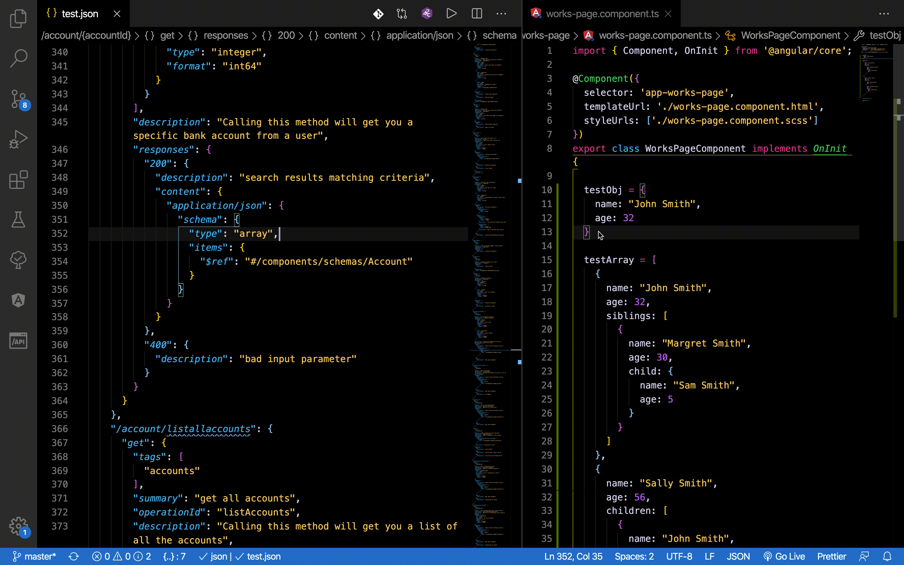

# Swagger Tools

A VSCode extension that helps in generating [openAPI (swagger) specs](https://swagger.io/specification/) from your editor.
Get it on the [VSCode Marketplace](https://marketplace.visualstudio.com/).

Got any feedback, issues or feature requests? Send them my way via [GitHub Issues](https://github.com/AaronDovTurkel/swagger-tools/issues).

See the [CHANGELOG](/CHANGELOG.md) for the latest changes.

- [Swagger Tools](#swagger-tools)
  - [Commands](#commands)
  - [Settings](#settings)
  - [Features](#features)
    - [*Generate & Paste Schema Object*](#generate--paste-schema-object)
  - [Upcoming Features](#upcoming-features)
    - [*Scaffold New Spec*](#scaffold-new-spec)
    - [*Generate Components*](#generate-components)
    - [*Generate Paths*](#generate-paths)
    - [*More to come...*](#more-to-come)
  - [Author](#author)
    - [Contributors](#contributors)

## Commands

| Command name             | Description                                                          | Shortcut             |
| ------------------------ | -------------------------------------------------------------------- | -------------------- |
| swagger-tools.pasteSchema| Generates an openAPI schema from an object or array in the clipboard | `ctrl/cmd + alt + v` |

## Settings

`Settings → Extensions → Swagger Tools`

| Setting                 | Description                                       | Allowed Values                           |
| ----------------------- | ------------------------------------------------- | ---------------------------------------- |
| swagger-tools.arrayType | Specify the type of array you want auto generated | *"anyOf"*, *"oneOf"*, *"allOf"*, *"not"* |

## Features

### *Generate & Paste Schema Object*

1. Copy the object or array you would like to generate
2. Go to the desired openAPI spec file
3. Place your cursor where you would like to paste your schema
4. Paste by typing the macro `ctrl/cmd + alt + v`

## Upcoming Features

The upcoming features list is order by expected release date...

### *Scaffold New Spec*

An easy and quick set up anyone on the team.

- Scaffold a new spec from scratch
- Choose between a complex or basic spec

### *Generate Components*

Select from a list of components to generate fully scaffolded schemas.
The schemas will be auto inserted in its proper field.
Setting to make nested objects/arrays referenced in `#/component/schemas`.

- schemas
- responses
- parameters
- examples
- requestBodies
- headers
- securitySchemes
- links
- callbacks

### *Generate Paths*

Fully generate paths with all their required fields.

- `GET, POST, PUT, PATCH, DELETE`

### *More to come...*

- Auto populate paths with request bodies, params, responses, etc...
- Linting
- Error decorators

## Author

Created and sustained by Aaron Turkel (a.k.a. [The Holy Coder](https://github.com/AaronDovTurkel)).

### Contributors

Have an idea that could make [Swagger Tools](#swagger-tools) better? [Contribute](https://github.com/AaronDovTurkel/swagger-tools)!
